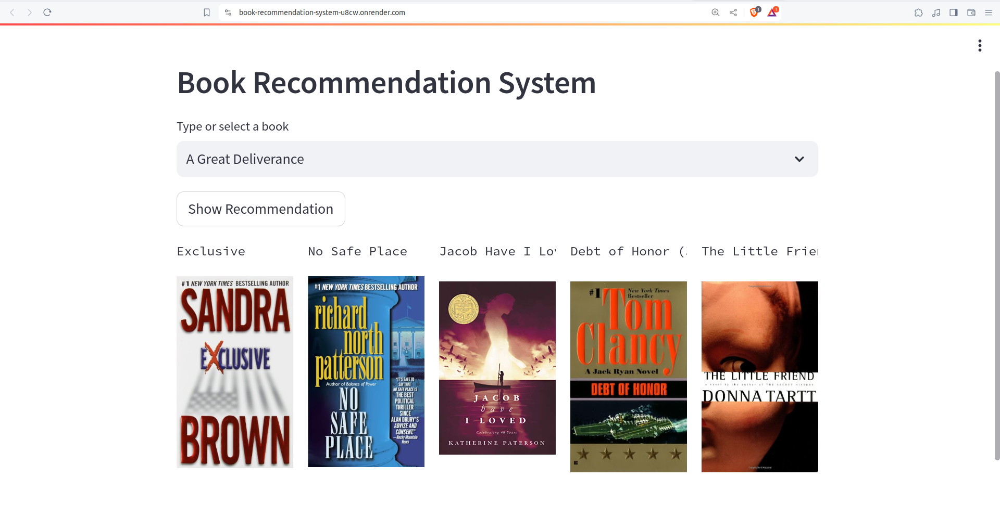
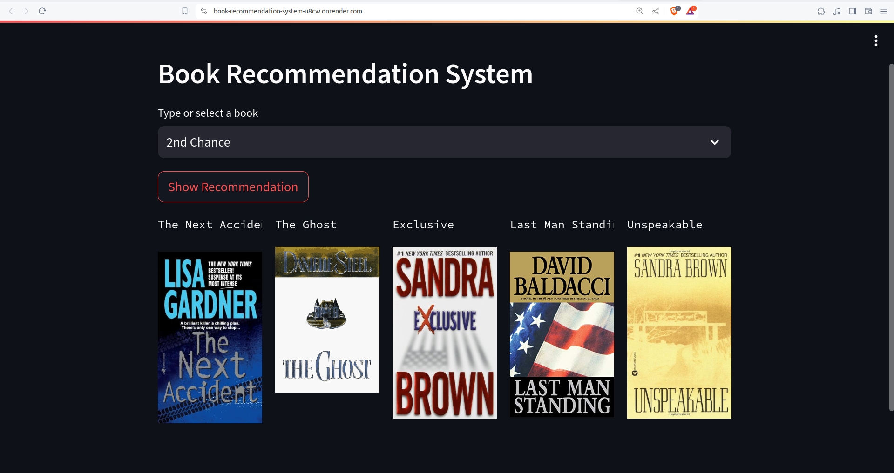

# Book Recommendation System

## About this project
This is a Streamlit web application for a ```Collaborative Filtering Based``` Book Recommendation System.

[Click here to run it](https://book-recommendation-system-u8cw.onrender.com/)

## Demo



## Dataset Used
The dataset used in this project can be found [here](https://www.kaggle.com/datasets/ra4u12/bookrecommendation).

## How to Run
### Steps:
1. Clone the repository:
   ```bash
    https://github.com/Shimul-Baidya/Book-Recommendation-System.git
2. Create a conda environment within the repository directory
   ```bash
   conda create -n books python=3.10 -y
   conda activate books
3. Install the requirements:
   ```bash
   pip install -r requirements.txt
4. Run the following notebook to generate the models:
   
   `Book Recommendaion.ipynb`
5. Run the Streamlit app:
   ```bash
   streamlit run app.py